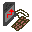
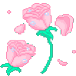
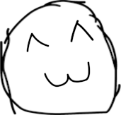
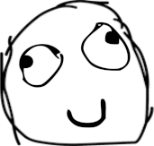
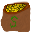
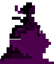
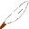
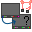
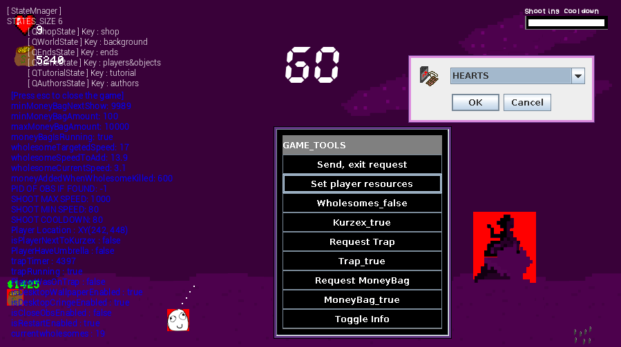

## What is unwholesome?

Unwholesome is a simple game that messes with the player pc and tries to prevent the player from closing it. The idea of ​​the game is similar to space shooting games but in a **cheap way**.

Putting a star on this repository is more than enough to support me
 

 Please open a new [issue](https://github.com/devsnaith/unwholesome/issues) if you faced a problem with the game.

#### Description
Unwholesome is a game designed to run on Windows, you can still run it on another operating system if you want, the game tries to kill taskmgr.exe and explorer.exe to prevent the player from closing it, the only way to stop this is to win.

#### The history
The source code for this game was lost and the only available version of this game was a single ``.exe`` file created in ``08/21/2021`` using [launch4j](https://launch4j.sourceforge.net/) in a Discord DMs.

I was able to decompile the ``.exe`` file using [jd-gui](https://github.com/java-decompiler/jd-gui). ~98% of the code decompiled without any problem, but the remaining 2% was just me rewriting missing stuff which led me to use [Eclipse IDE](https://eclipseide.org/) to easily debug and reformat the source code.

I would like to thank **Kurzex** for drawing the objects in the game and **x6ds** for making the awesome sound effects.

I would also like to thank [@PurpleHallos](https://github.com/PurpleHallos) for being willing to try the game, which motivated me to try to rescue the source code again, this way anyone can easily change or add anything to the game without going through what I did.




## Binaries

This game must be run as **administrator**, tactically you can still run it without administrator, but good luck with that ;)

There are multiple options, choose the one you like. Clicking on the file name will download it

| Name                                                                                                                                       | Type                           | Description                                                                                                                                                                  |
|--------------------------------------------------------------------------------------------------------------------------------------------|--------------------------------|------------------------------------------------------------------------------------------------------------------------------------------------------------------------------|
| [unwholesome-SFX.exe](https://github.com/devsnaith/unwholesome/releases/download/v0.1.0/unwholesome-0.1.0-SFX.exe)                         | self extracting archive (.exe) | This binary contains the game and Java Runtime so you don't have to install it **(recommended)**                                                                             |
| [unwholesome-without-jre-SFX.exe](https://github.com/devsnaith/unwholesome/releases/download/v0.1.0/unwholesome-without-jre-0.1.0-SFX.exe) | self extracting archive (.exe) | This binary contains the game without the Java Runtime, so you will need to [install it manually](https://www.java.com/en/download/manual.jsp) for the game to work          |
| [unwholesome.zip](https://github.com/devsnaith/unwholesome/releases/download/v0.1.0/unwholesome-0.1.0.zip)                                 | compressed archive (.zip)      | Archive contains the game ``.exe`` file with Java Runtime included with it so you don't have to install it **(recommended)**                                                 |
| [unwholesome-without-jre.zip](https://github.com/devsnaith/unwholesome/releases/download/v0.1.0/unwholesome-without-jre.zip)               | compressed archive (.zip)      | Archive contains the game ``.exe`` file without the Java Runtime so you will need to [install it manually](https://www.java.com/en/download/manual.jsp) for the game to work |

> Note that you will need to choose the compressed archive (.zip) if you want to enable debug mode in the game, which we will explain later.



## Build From Source

To build the project on Linux you need to have [git](https://git-scm.com/book/en/v2/Getting-Started-Installing-Git) and [JDK](https://docs.oracle.com/en/java/javase/22/install/installation-jdk-linux-platforms.html)

Use the package manager that came with your distribution, then:

```
$ git clone https://github.com/devsnaith/unwholesome
$ cd unwholesome
$ ./gradlew build
```

This will build the project and create an ``unwholesome.jar`` file and will also move important folders like ``Audios`` and ``libraries`` next to the jar file for you, the configuration file ``meow.conf`` will also get moved the the output path.


The output will be at ``build/libs/``, Now you can navigate to it using

```
$ cd build/libs
```

Now this folder is ready to get shipped to windows, just make share ``libraries`` is next to the ``unwholesome.jar`` file, the audio folder is not important.

Make sure the operating system you're shipping the game to has Java pre-installed, or you can ship the JRE with the game using tools like [launch4j](https://launch4j.sourceforge.net/).

Run the game using:

```
$ java -jar java -jar unwholesome.jar
```

## How to play it?
In this game there will be a lot of emojis falling from top to bottom, if one of them touches you you will get hurt, use the [W, S, A and D] keys to move and avoid them, you can shoot at the enemies by pressing the left mouse button, move the cursor to aim at them, Every enemy that reaches the bottom and dies will give you money, use this money to buy items from the vendor that will help you complete the game.

In the store you will see the bad things that the game will do when you lose, buy them to disable them, if you disable them you will win, If you use [OBS](https://obsproject.com/) to record the game, a new item will be added to your store to kill [OBS](https://obsproject.com/), if you didn't buy it, your [OBS](https://obsproject.com/) will get killed.



### The Money Bag
From time to time you will see a money bag on the left side of the screen, you can take advantage of it, the bag will not disappear, to generate another bag you have to take it.


### Shooting Cooldown

When shooting, always keep an eye on the cooldown progress bar, the more you shoot, the slower the speed becomes, stop shooting to restore your shooting speed. When no bullets appear on the screen, move your player to speed up the cooldown.

### Characters

There are two characters in the game, the player and the seller.

| Characters                                                                                        | Characters Name  | Mission                                                                                                            |
|---------------------------------------------------------------------------------------------------|------------------|--------------------------------------------------------------------------------------------------------------------|
|  | (Player), YOU    | Use the money you get to disable the bad commands from the vendor to save your computer. |
|   | (vendor), Kurzex | Selling things that will help you complete the game and also from me you can disable the bad things that will happen to your computer. |

### Items Sold by Kurzex (the vendor)

| Items Icon | Items Name | benefit |
| --- | :---: | --- |
|  | Heart | Add +1 to your Heart
|  | Umbrella | Add Unfortunately this item will act as a shield for 30s
|  | Slowdown | Makes the Emojis slower (You can buy it more than once)
|  | Leave my wallpaper | Buy this Item to keep your wallpaper from changing.
|  | Don't Make Cringe! | Buy this Item to keep your desktop clean.
|  | Leave my obs | Buy this to prevent your [OBS](https://obsproject.com/) from being killed. (Only when OBS detected)
|  | Don't Restart pc | Buy this to prevent your computer from restarting.

## Configuration & Debugging

To open the debug menu in the game, you need to download ``unwholesome-without-jre.zip`` or ``unwholesome.zip`` (if you don't have a [JRE installed](https://www.java.com/en/download/manual.jsp)), these files shiped with ``meow.conf`` but ``*.sfx.exe`` does not, the debug menu can still be run in the ``*.sfx.exe`` versions because the game in the ``*.sfx.exe`` versions are extracted in ``%TEMP%`` or ``(C:\Users\%USERNAME%\AppData\Local\Temp)``, although moving the configuration file before the game gets loaded is a bit tricky.

### The configuration file ``meow.conf``

The ``meow.conf`` need to be next to the ``unwholesome.jar`` or ``unwholesome.exe`` (Not the ``sfx`` versions), this configuration file is a ``key=value`` type and it is sooo simpleee, you can set 3 keys in it.

| key    | value   | description                                 |
|--------|---------|---------------------------------------------|
| debug  | 0 or 1  | run the game in debug mode, 0=false, 1=true |
| width  | \<int\> | Specifies the game window width             |
| height | \<int\> | Specifies the game window height            |

> Note: Changing the game dimension is not preferred but you can do it anyway

### Debugging



Running the game in debug mode will disable the commands that the game will invoke when the player loses, so running the game in debug mode is important when developing it on Linux.

The game ignores any close request, but enabling debug mode will allow you to close the game at any time by pressing the Escape key, setting ``debug`` key to ``1`` in the configuration file will enable the debug mode.

## Me Playing it ;)

[gameplay](./docs/media/gameplay.mp4)